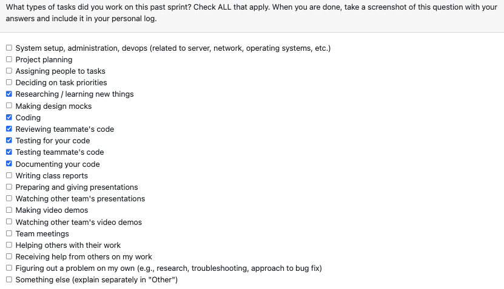

# Personal Log – Karim Jassani
---
## Entry for Week 1, Jan 5 - Jan 11

### Type of Tasks Worked On

### Type of Tasks Worked On
- Investigated Git code parsing behavior and author selection logic
- Updated tests to cover username vs email identifier selection
- Added/verified logging for which author identifier is used
- Fixed failing test assertions and log expectations
- Validated CLI parsing flow for collaborative vs solo detection

---

### Recap of Weekly Goals
✅ Validate Git code parsing behavior — Completed
✅ Strengthen test coverage for parsing identifiers — Completed
✅ Improve debuggability with clearer logs — Completed

---

### Features Assigned to Me
#437: BUGFIX: Git Code Parsing - Closed by PR #438

---

### Associated Project Board Tasks
| Task/Issue ID | Title                                                                   | Status     |
|---------------|-------------------------------------------------------------------------|------------|
| #437          | BUGFIX: Git Code Parsing                                              | Closed     |

---

### Issue Descriptions

Fixed and validated Git code parsing behavior, especially around author identifier selection. Ensured the parsing flow correctly prefers the expected identifier, added logging to make debugging easier, and expanded test coverage.

Key implementations:
- Added tests for no user prefs, username‑only, and email‑only cases
- Updated test assertions to match new log output
- Verified author identifier selection and logging output
- Ensured collaborative detection does not block parsing

---

### Progress Summary
- **Completed this week:**
Expanded test coverage for run_git_parsing_from_files, updated logging expectations, and confirmed identifier selection behavior for Git parsing. Addressed CI failures tied to log output changes and test alignment.

---

### Plan for Next Cycle
- Explore the project score vs project rank issue
- Allow user to customize project rank
