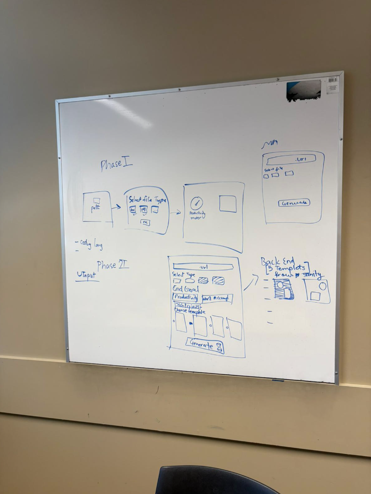

# Team Log week 3

**Team Name:** Group 3 (Canvas) / Team 15 (GitHub)  
**Work Performed:** Sept 15, 2025 → Sept 21, 2025

---

## Recap of Milestone Goals

- **Features planned for this milestone:**
  - Work Breakdown Structure, Functional, and Non-Functional requirements gathering and evaluation
  
- **Associated project board tasks:**
  - N/A

---

## Burnup Chart

_Accumulative view of tasks done, tasks in progress, and tasks left to do._  
Paste chart image or link here:  

---

## Team Members

| Username (GitHub) | Student Name   |
|-------------------|----------------|
| @KarimKhalil33    | Karim Khalil   |
| @<username_here>  | Karim Jassani  |
| @dabby04   | Oluwadabira    |
| @PaintedW0lf  | Vanshika       |
| @6s-1  | Shreya         |
| @afuaf  | Afua           |

---

## Completed Tasks

| Task/Issue ID | Title                  | Username        |
|---------------|------------------------|-----------------|
| #N/A          | Project Requirements   | @KarimKhalil33  |
| #N/A          | Project Requirements   | @6s-1     |
| #N/A          | Project Requirements   | @afuaf     |
| #N/A          | Project Requirements   | @dabby04     |
| #N/A          | Project Requirements   | @PaintedW0lf     |
| #N/A          | Project Requirements   | @<username_here>     |

---

## In Progress Tasks

| Task/Issue ID | Title            | Username |
|---------------|------------------|----------|
| N/A           | None this week   | N/A      |

---

## Meeting Notes

### 16th September 2025 – Team Meeting (All members present)
- Initial discussions on:
  - Target Users
  - Project Goal
  - Functional Requirements
  - Non-Functional Requirements
  - Testing the Requirements
  - Additional Use Cases
📷 Screenshot:  

### 17th September 2025 – Team Meeting (All members present)
- Discussions on:
  - Functional Requirements
  - Non-Functional Requirements
📷 Screenshot:  

### 19th September 2025 – Team Meeting (All members present)
- Final discussions for project requirements on:
  - Target Users
  - Project Goal
  - Functional Requirements
  - Non-Functional Requirements
  - Testing the Requirements
  - Additional Use Cases

📄 **Link to full discussion notes (Google Doc):**  
[Project Requirements Document](https://docs.google.com/document/d/1rZrTRaB4aCsSq-8ItgeyiAddLhKEmk9HRukIjU-_uVQ/edit?tab=t.0#heading=h.7glrk37gh6jj)

---

## Test Report

- **Framework used:** N/A  
- **Test run date:** N/A  
- **Summary:**  
  - Total tests run: N/A  
  - Passed: N/A  
  - Failed: N/A  
- **Regression Testing:**  
  - N/A  
- **Screenshot or Output:**  
  *(Insert here if available)*
