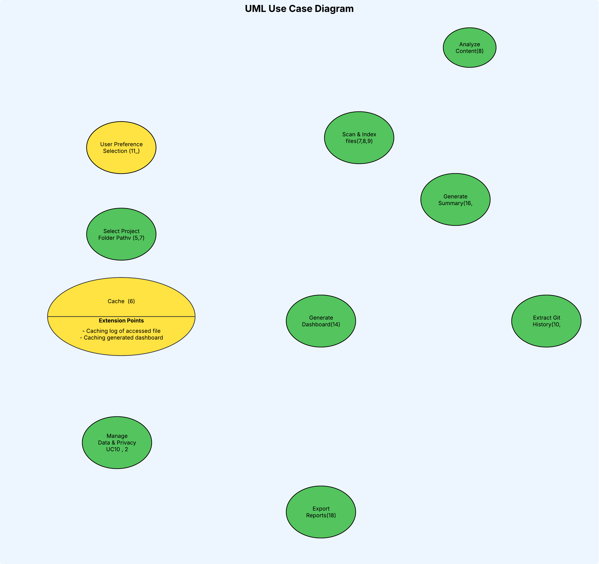

# Team Log week 4

**Team Name:** Team 3

**Work Performed:** Sept 22, 2025 → Sept 28, 2025

---

## Recap of Milestone Goals

- **Features planned for this milestone:**
  * System architecture diagram refinement and validation
  * Use case description finalization and UML diagram
  * Functional and non-functional requirement-to-test case mapping
  * Task assignment for upcoming development phases
  * Project Scope, usage scenario, and proposed solution
  
- **Associated project board tasks:**
  - N/A

---

## Burnup Chart

_Accumulative view of tasks done, tasks in progress, and tasks left to do._  
Paste chart image or link here:  

---

## Team Members

| Username (GitHub) | Student Name   |
|-------------------|----------------|
| @KarimKhalil33    | Karim Khalil   |
| @kjassani         | Karim Jassani  |
| @dabby04          | Oluwadabira Omostos|
| @PaintedW0lf      | Vanshika Singla|
| @6s-1             | Shreya Sanexa  |
| @abstractafua     | Afua Frempong  |

---

## Completed Tasks

| Task/Issue ID | Title                  | Username        |
|---------------|------------------------|-----------------|
| #N/A          | Project Requirements   | @KarimKhalil33  |
| #N/A          | Project Requirements   | @6s-1     |
| #N/A          | Project Requirements   | @abstractafua     |
| #N/A          | Project Requirements   | @dabby04     |
| #N/A          | Project Requirements   | @PaintedW0lf     |
| #N/A          | Project Requirements   | @kjassani    |

---

## In Progress Tasks

| Task/Issue ID | Title            | Username |
|---------------|------------------|----------|
| N/A           | None this week   | N/A      |

---

## Meeting Notes

### 23rd September 2025 – Team Meeting (All members present)
- Initial discussions on:
  - System Architecture Design
  - Deciding what layers should be present
  - Conclusion on what should be stored in Cache metadata

### 25th September 2025 – Team Meeting (All members present)
- Discussions on:
  - Project Scope and Usage Scenario
  - Proposed Solution
  - Use Cases

### 26th September 2025 – Team Meeting (All members present)
Requirements to use case mapping
📷 Screenshot: 

📄 **Link to full discussion notes (Google Doc):** 
[System Architecture Diagram](https://docs.google.com/document/d/19W4OrfsrNVxUNlPoS4ta6p-XL-L4EiG759ChwR6vOP0/edit?usp=sharing) 

[Project Proposal Document](https://docs.google.com/document/d/1CaCEQzTQ6n75Ijxt_pxf_ZtKsmnacfRh4bi00N9GilQ/edit?tab=t.0)

---

## Test Report

- **Framework used:** N/A  
- **Test run date:** N/A  
- **Summary:**  
  - Total tests run: N/A  
  - Passed: N/A  
  - Failed: N/A  
- **Regression Testing:**  
  - N/A  
- **Screenshot or Output:**  
  *(Insert here if available)*

---

## Plan for Next Cycle
- Data Flow Diagram (DFD) creation and review
