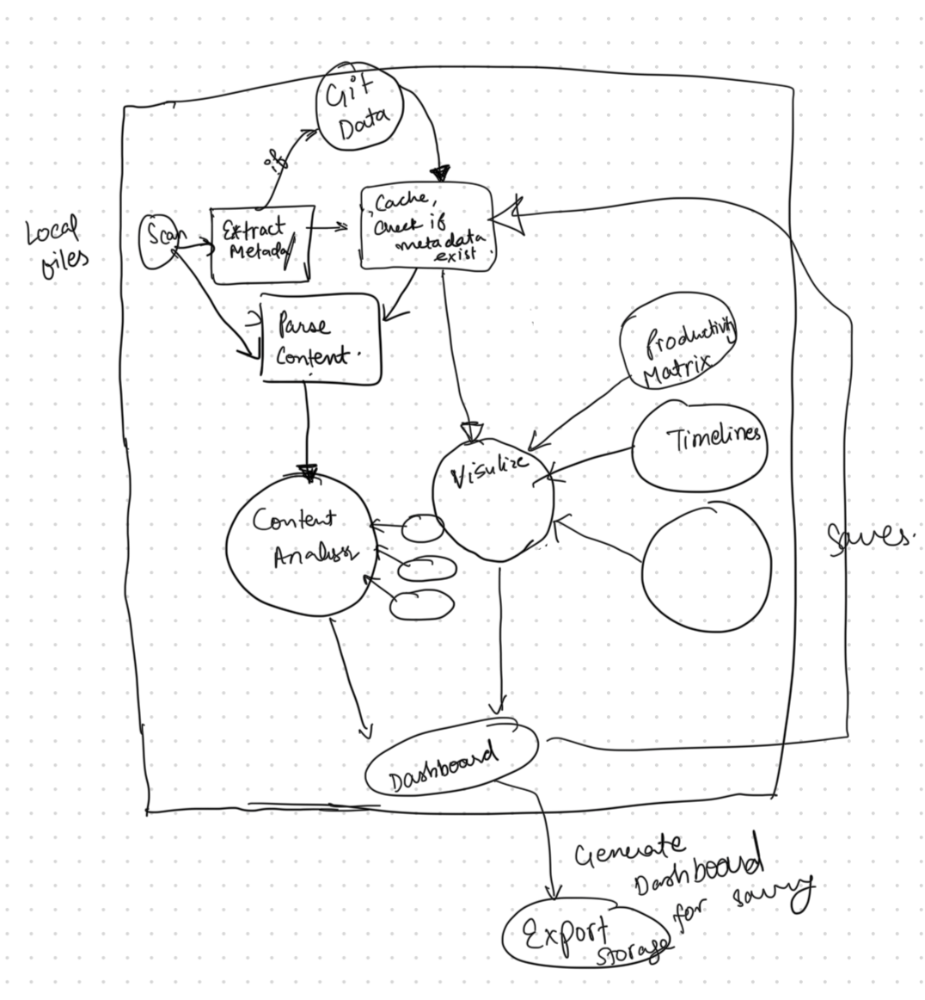

# Team Log week 5

**Team Name:** Team 3

**Work Performed:** Sept 29, 2025 → Oct 5, 2025

---

## Recap of Milestone Goals

- **Features planned for this milestone:**
  * Understanding the purpose and structure of DFD
  * Creating a level 0 and a level 1 DFD for our productivity dashboard
  
- **Associated project board tasks:**
  - N/A

---

## Burnup Chart

_Accumulative view of tasks done, tasks in progress, and tasks left to do._  
Paste chart image or link here:  

---

## Team Members

| Username (GitHub) | Student Name   |
|-------------------|----------------|
| @KarimKhalil33    | Karim Khalil   |
| @kjassani         | Karim Jassani  |
| @dabby04          | Oluwadabira Omotoso|
| @PaintedW0lf      | Vanshika Singla|
| @6s-1             | Shreya Sanexa  |
| @abstractafua     | Afua Frempong  |

---

## Completed Tasks

| Task/Issue ID | Title                  | Username        |
|---------------|------------------------|-----------------|
| #N/A          | DFD Levels 0 and 1  | @KarimKhalil33  |
| #N/A          | DFD Levels 0 and 1   | @6s-1     |
| #N/A          | DFD Levels 0 and 1   | @abstractafua     |
| #N/A          | DFD Levels 0 and 1    | @dabby04     |
| #N/A          | DFD Levels 0 and 1    | @PaintedW0lf     |
| #N/A          | DFD Levels 0 and 1    | @kjassani    |

---

## In Progress Tasks

| Task/Issue ID | Title            | Username |
|---------------|------------------|----------|
| N/A           | None this week   | N/A      |

---

## Meeting Notes

### 29th September 2025 – Team Meeting (All members present)
- Initial discussions on:
  - Mapped out what the DFD should look like
  - DFD Level 0 (who the entities and what the process is)

### 30th September 2025 – Team Meeting (All members present)
- Discussions on:
  - Finalising DFD Level 0
  - DFD Level 1: process, entity, data store, data flows
  - 

### 1st October 2025 – Team Meeting (All members present)
- Made adjustments to DFD Level 1

📄 **Link to full discussion notes (Lucid Chart):** 

[Level 0](https://lucid.app/lucidchart/b7e28ba3-b25f-465d-8621-6eb55b73ac8e/edit?viewport_loc=-5388%2C-1753%2C14601%2C8319%2C0_0&invitationId=inv_101b7100-074d-4aea-bb4b-8736ccb45722) 

[Level 1](https://lucid.app/lucidchart/46c523e8-0308-456d-b081-d21c6c0a9cb6/edit?invitationId=inv_8c16901d-9246-4b3c-84b2-db6ab0653554)

---

## Test Report

- **Framework used:** N/A  
- **Test run date:** N/A  
- **Summary:**  
  - Total tests run: N/A  
  - Passed: N/A  
  - Failed: N/A  
- **Regression Testing:**  
  - N/A  
- **Screenshot or Output:**  
  *(Insert here if available)*

---

## Reflection
* Individual reflections present in the personal logs 

---

## Plan for Next Cycle
* Update repo README with link to system final system architecture diagram with explanation
* Update repo README with link to DFD Level 1 with explanation
* Update repo README with link to revised WBS
* Explore Docker for the system setup 
