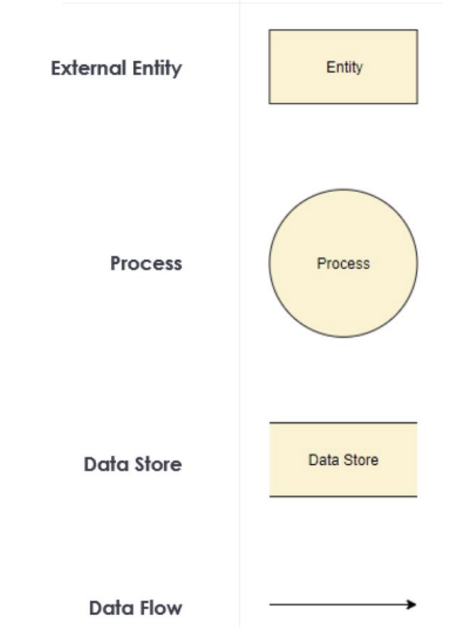
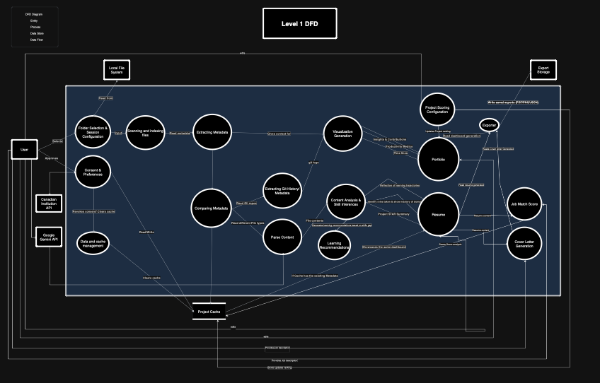

# Data Flow Diagram Level 1

### Legend

# Description of the Diagram

Once the user starts the application, they are presented with the **Consent and Preferences form**. If the user declines or revokes consent, the system deletes all previously stored information. Otherwise, the system allows the user to select a **zipped project folder** from their local file system. The folder is then decompressed, scanned, and indexed. Using the extracted metadata, the system compares it with any previously stored metadata.

If the metadata matches existing data, the system skips the analysis process and proceeds directly to the **Dashboard and Resume Generation** stages, including alerts and visualization updates.  
If the metadata does not match, the system stores the new metadata locally and continues with the following processes:

1. **Timeline and Productivity Analysis:**  
   Sends project timelines and productivity metrics to the visualization and report generation module.

2. **Git Data Extraction:**  
   Reads Git repositories (if present) to collect commit logs, insights, contributions, timelines, and productivity data, which are then used in both the visualization analysis and skill inference processes for the resume.

3. **Content Parsing:**  
   Analyzes both code and non-code files to identify individual contributions and feed them into the content analysis and skill inference modules.

After all analyses are completed — including **Visualization Analysis & Generation** and **Content Analysis & Skill Inference for Resume** — the system generates graphs, learning reflections, project STAR summaries, and identifies roles and skill mastery levels. These outputs are integrated into the **Dashboard and Resume Generation** processes.

The system also compares top-ranked projects stored over time, retrieves the top three, and fetches historical data chronologically from local storage to display on the dashboard and resume view.

An **Export Module** is connected to this process, allowing users to export generated reports in **PDF**, **PNG**, or **JSON** formats. Finally, users can delete previously generated data directly from the local database.