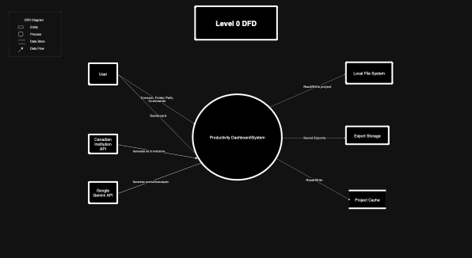
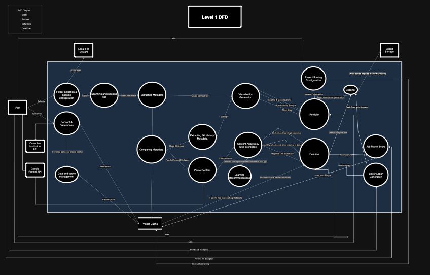
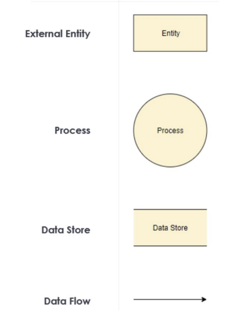

# Data Flow Diagrams (Level 0 & Level 1)

## View the diagrams (interactive)

**[DFD_Team-3.drawio — Google Drive, click open via draw.io](https://drive.google.com/file/d/10cYCpvFpWB_LUyqjNVTxVPAnlgEQ53dM/view?usp=sharing)**

The file includes Level 0 and Level 1 DFD.

## Static copies in this repository

These PNGs match the current Level 0 (context) and Level 1 diagrams:

### Level 0 — context diagram

### Level 1 — system decomposition

### Legend

---

## What the diagrams describe

### Level 0 — system context

The context diagram places **Productivity Dashboard / System** at the center. The **User** supplies consent, folder paths, and commands; the system returns the **dashboard** experience. **Local File System** exchanges project files with the system (read/write). **Export Storage** receives saved exports (e.g. PDF, PNG, JSON).

External services sit outside the boundary: the **Canadian Institution API** supplies institutional data used in preferences and related flows; the **Google Gemini API** supplies model-backed analysis and generation where the product uses LLMs. **Project Cache** is the internal data store for persisted project metadata and analysis state, with read/write flows to and from the system. Together, these elements show the dashboard as dependent on local files, cached project data, exports, and selected third-party APIs—not only on “open a folder and render a page.”

### Level 1 — main processes and data paths

Inside the system boundary, work moves from ingestion through analysis to user-facing outputs and exports.

**Session, consent, and file intake** — **Folder Selection & Session Configuration** and **Consent & Preferences** capture how the user starts a session and what the app may store. **Scanning and Indexing Files** walks the extracted tree; **Data and Cache Management** and **Project Cache** coordinate what gets created or updated. **Extracting Metadata**, **Comparing Metadata**, **Parse Content**, and **Extracting Git History / Metadata** turn raw files and repos into structured signals used downstream.

**Analysis and presentation** — **Visualization Generation** builds timelines, productivity views, and contribution-oriented outputs for the **Portfolio**. **Content Analysis & Skill Inferences** consumes parsed file content; the **Google Gemini API** attaches to this process wherever the implementation delegates summarization or inference to an LLM. Results feed STAR-style narratives, role/skill views, and the **Resume**.

**Recommendations and evaluation** — **Learning Recommendations** combines parsed skills and gaps with profile context and curated learning resources; ties to **Canadian Institution API** appear where institutional lookup supports preferences or education fields. **Project Scoring Configuration** connects rankings and scores from cached analysis back into how projects appear in the portfolio. These steps add prescriptive and evaluative behavior alongside descriptive reporting.

**Career-oriented outputs** — **Resume** is both an artifact users edit and an input to **Job Match Score** and **Cover Letter Generation**, which take resume-aligned content plus a user-supplied **job description** to produce match scoring and tailored application text. **Portfolio** aggregates visualization, recommendations, scoring, and edited project views. **Exporter** reads portfolio, resume, and cover-letter outputs and writes to **Export Storage**.

**Analysis vs. decision support** — Ingestion and parsing establish a factual base; learning suggestions, scoring, job matching, and cover-letter generation layer judgment and personalization on top, so the DFD reads as one pipeline from files and consent through intelligence services to dashboards, documents, and exports.

---

## Description of the system flow

When the user starts the application, they see **Consent and Preferences**. If consent is declined or revoked, stored data is removed. With consent, the user can select a **zipped project folder** from the **local file system**; the archive is unpacked, **scanned**, and **indexed**. Extracted **metadata** is compared with **Project Cache** (and related stored metadata).

If metadata matches existing analyzed work, the system can **skip re-analysis** and refresh dashboard, portfolio, and resume views as appropriate. If not, new metadata is persisted and processing continues:

1. **Timeline and productivity** — timelines and metrics feed **visualization** and reporting.  
2. **Git** — when present, commit history supports insights, contributions, timelines, and skill-related signals for the resume and portfolio.  
3. **Content parsing** — code and non-code files are parsed to support contribution narrative and **content analysis / skill inference** (with **Google Gemini** where used for summaries and inferences).

**Visualization** and **content analysis** produce graphs, reflections, **STAR-style project summaries**, and role/skill signals integrated into **Portfolio** and **Resume**. **Learning recommendations** use saved profile, resume-aligned signals, and curated resources (and institutional context where applicable) to suggest next learning steps. **Project scoring** updates how projects are ranked and presented.

The user can **edit** portfolio and resume content. **Job match** and **cover letter** flows take **resume (and related) content** plus a **job description** to produce scores and drafts. An **Exporter** writes **PDF**, **PNG**, or **JSON** to **export storage**. Users can also clear or manage stored data via the app’s data/cache flows.
