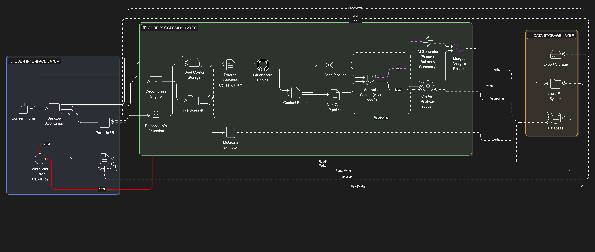

 # System Architecture Diagram
 
 [View full‑size diagram as PDF](System_Architecture_updated.pdf)

 _Note: Diagram is shown in the PDF for a clearer, high‑resolution view._

 ## Description of the diagram
The system architecture is organized into three layers: the User Interface layer, the Core Processing layer, and the Data Storage layer. Together, these layers support the end-to-end workflow of transforming a user’s raw project data into structured, customizable portfolio and résumé outputs.

## 1. User Interface Layer

The entry point for all user interactions, built as a **Desktop Application**.

- **Security & Consent:** A "hard gate" consent mechanism ensures no data analysis occurs without explicit user authorization.
- **Data Ingestion:** Users upload project ZIP files directly into the UI for processing.
- **Visualization:** The **Portfolio UI** and **Resume** views render the final analysis, scores, and generated metrics.

## 2. Core Processing Layer (FastAPI Backend)

The "engine" of the system, orchestrated by a **FastAPI** backend that manages data transformation and analysis logic.

- **Pre-Processing:** Raw uploads are handled by a **Decompress Engine** and **File Scanner**. Each project is assigned a unique signature to prevent redundant analysis and ensure data integrity.
- **Dual-Track Pipeline:**
  - **Code Pipeline:** Analyzes source files and utilizes a **Git Analysis Engine** to extract repository-level signals and contribution data.
  - **Non-Code Pipeline:** Parses documentation and project metadata to classify individual versus collaborative contributions.
- **Hybrid Analysis Mode:** The system features an **Analysis Choice** logic. It can operate in **Local-only** mode for maximum privacy or **AI-enhanced** mode (via **Gemini**) to generate enriched resume bullets and professional summaries.
- **The Merger:** Final outputs from both pipelines are synthesized into a unified project profile, including skills, scores, and dashboard metrics.

