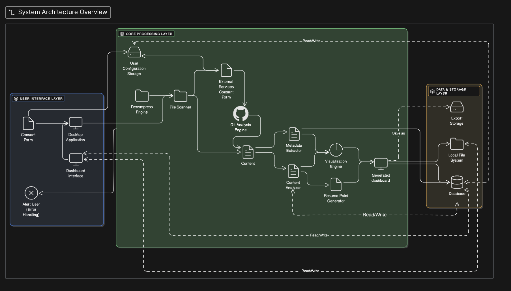

 # System Architecture Diagram
 

 ## Description of the diagram
The explanation below links each functional requirement to the specific component in the system architecture where it is implemented. Data interactions such as “write to Database” or “retrieves from Database” indicate flow between components. Together, these mappings show how the system moves from user consent and file processing to project analysis, ranking, visualization, and storage.

1. **Require consent before proceeding** → Consent Form (UI layer) gates the whole pipeline.  
2. **Parse a zipped folder (nested)** → Decompress Engine unzips; File Scanner walks contents.  
3. **Error on wrong format** → Decompress Engine validates and calls Alert User.  
4. **Permission + privacy for external services (LLM)** → External Services Consent Form (Core); gates all external calls.  
5. **Alternative analyses if externals not permitted** → Content Analyzer and Git Analysis Engine run local-only path (no data egress).  
6. **Store user configurations** → Write to User Configuration Storage.  
7. **Distinguish individual vs collaborative** → Git Analysis Engine (coding projects); Content Analyzer (non-coding projects).  
8. **Identify language & framework (coding)** → Content Analyzer (language/framework detectors).  
9. **Extrapolate individual contributions** → Git Analysis Engine (coding projects); Content Analyzer (non-coding projects).  
10. **Extract key contribution metrics (duration, activity mix, etc.)** → Metadata Extractor computes signals; Content Analyzer aggregates.  
11. **Extract key skills** → Content Analyzer (skill mining).  
12. **Output all key info for a project** → Content Analyzer identifies and analyzes key info for a project.  
13. **Store project info into Database** → Write from Content Analyzer to Database.  
14. **Retrieve previously generated portfolio info** → Content Analyzer reads from Database.  
15. **Retrieve previously generated résumé item** → Content Analyzer reads from Database.  
16. **Rank projects by user’s contributions** → Content Analyzer (ranking module).  
17. **Summarize top-ranked projects** → Content Analyzer (summaries) and Visualization Engine renders.  
18. **Delete insights without breaking shared files** → Dashboard Interface issues scoped deletes; write from Dashboard Interface to Database.  
19. **Chronological list of projects** → Retrieves from Database to Content Analyzer; produces chronological list and writes to Database.  
20. **Chronological list of skills exercised** → Retrieves from Database to Content Analyzer; produces chronological list and writes to Database.